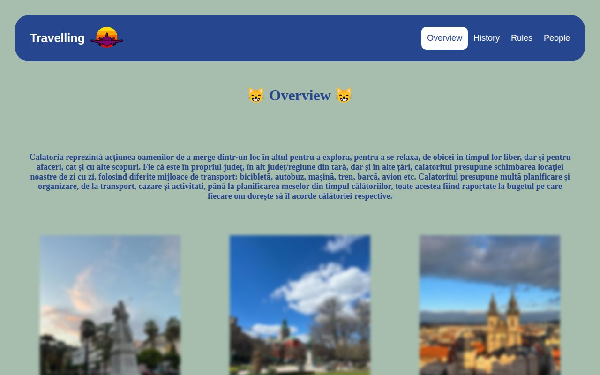
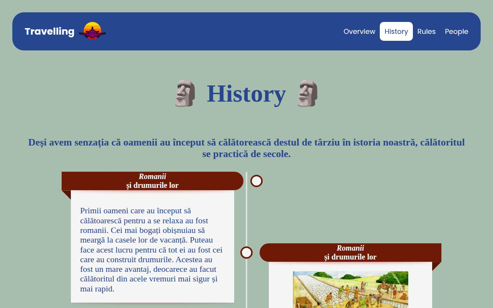
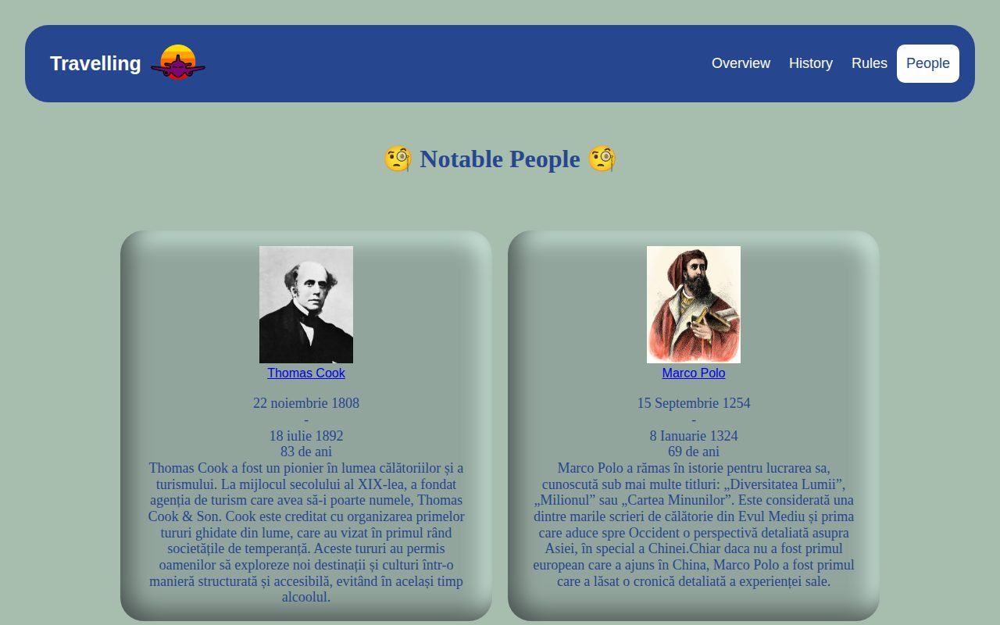

# Travelling as a Hobby ✈️

A multi-page website about travelling: what it is, how it evolved through history, what to check before a trip, and famous travellers. Built with **HTML, CSS and JavaScript**, and it works on phones too (with a burger menu). The content is in Romanian.

## Pages

- **Overview**: why people travel, with a comparison table
- **History**: a timeline from the Roman roads to modern tourism
- **Rules**: things to check before a trip, in expandable sections
- **People**: famous travellers like Marco Polo, Magellan and Amelia Earhart

| History | People |
|---|---|
|  |  |

## How to run

Open `index.html` in your browser. No installation needed.

## Author

Alexandra Zahiu
